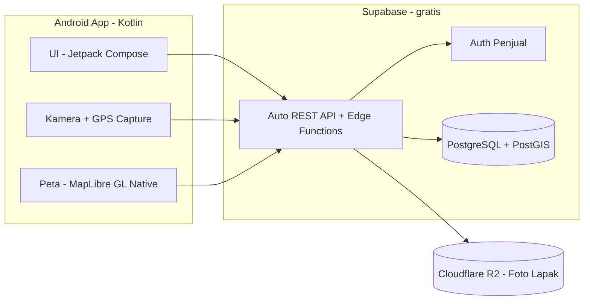

# PRD: CariJajan — Aplikasi Pencari & Penjual Makanan Kaki Lima

- **Versi:** 1.0
- **Tanggal:** 15 Juli 2026
- **Status:** Draft awal untuk pengembangan MVP
- **Catatan nama:** "CariJajan" hanya nama sementara/placeholder — ganti sesuai selera.

## Daftar Isi
1. [Ringkasan Eksekutif](#1-ringkasan-eksekutif)
2. [Latar Belakang & Masalah](#2-latar-belakang--masalah)
3. [Tujuan Produk](#3-tujuan-produk)
4. [Target Pengguna & Persona](#4-target-pengguna--persona)
5. [Ruang Lingkup](#5-ruang-lingkup)
6. [Kebutuhan Fungsional](#6-kebutuhan-fungsional)
7. [Kebutuhan Non-Fungsional](#7-kebutuhan-non-fungsional)
8. [Arsitektur Teknis](#8-arsitektur-teknis)
9. [Skema Database](#9-skema-database-detail)
10. [Spesifikasi API](#10-spesifikasi-api-ringkas)
11. [Alur Pengguna Utama](#11-alur-pengguna-utama)
12. [Perbandingan & Rekomendasi Layanan Gratis](#12-perbandingan--rekomendasi-layanan-gratis)
13. [Keamanan & Privasi](#13-keamanan--privasi)
14. [Rekomendasi Tambahan Agar Terlihat Profesional](#14-rekomendasi-tambahan-agar-terlihat-profesional)
15. [Roadmap Pengembangan](#15-roadmap-pengembangan)
16. [Metrik Keberhasilan](#16-metrik-keberhasilan)
17. [Risiko & Mitigasi](#17-risiko--mitigasi)
18. [Catatan Sumber](#18-catatan-sumber)

---

## 1. Ringkasan Eksekutif

CariJajan adalah aplikasi Android yang menghubungkan pembeli dengan pedagang kaki lima di sekitar mereka secara real-time berbasis lokasi.

- **Penjual** mendaftar sekali, lalu setiap kali mengunggah foto dagangan/lapaknya, aplikasi otomatis merekam titik GPS dan waktu pengambilan foto sehingga lapak langsung muncul sebagai marker di peta.
- **Pembeli** tidak perlu mendaftar — cukup buka aplikasi, izinkan akses lokasi, dan langsung melihat pedagang kaki lima dalam radius <10 km lewat peta atau daftar, lengkap dengan info harga, jenis dagangan, dan status buka/tutup.

Masalah inti yang diselesaikan: pedagang kaki lima umumnya tidak punya lokasi tetap dan tidak terdaftar di platform manapun (GoFood/GrabFood mensyaratkan proses onboarding formal yang berat untuk skala usaha harian seperti ini), sehingga sulit ditemukan pembeli baru di luar area langganan tetap mereka.

## 2. Latar Belakang & Masalah

- Pedagang kaki lima (cilok, batagor, siomay, gorengan, es, dll) sering berpindah tempat mengikuti jam ramai (pagi di titik A, sore di titik B).
- Tidak ada plang/alamat tetap, sehingga pembeli baru di suatu area tidak tahu ada pedagang menarik di dekatnya.
- Platform delivery besar mensyaratkan legalitas usaha dan skema komisi yang memberatkan pedagang bermodal harian.
- Pembeli sering hanya ingin tahu "ada jajanan apa di sekitar sini sekarang" tanpa perlu proses pemesanan/pembayaran digital — datang dan beli langsung di tempat (walk-up).

## 3. Tujuan Produk

**Tujuan bisnis:** membangun basis pedagang kaki lima aktif di satu wilayah percontohan sebelum ekspansi, dengan model 100% gratis di tahap awal untuk memaksimalkan adopsi kedua sisi.

**Tujuan pengguna:**
- Penjual: cara termudah untuk "terlihat" oleh pembeli baru tanpa proses administratif berat.
- Pembeli: menemukan jajanan terdekat dalam hitungan detik, tanpa perlu akun.

Indikator keberhasilan dibahas di Bagian 16.

## 4. Target Pengguna & Persona

**Persona A — Penjual ("Pak Dedi", pedagang cilok keliling)**
Usia 35–55, HP Android kelas menengah-bawah, tidak terlalu melek teknologi, berpindah lokasi jualan tiap hari. Butuh alur pendaftaran & unggah lapak yang sangat sederhana (idealnya <2 menit dari buka app sampai lapak tayang).

**Persona B — Pembeli ("Sarah", mahasiswa/pekerja)**
Usia 18–35, mager keluar jauh, ingin tahu jajanan apa yang tersedia di radius jalan kaki/motor dekat. Tidak mau proses daftar akun hanya untuk melihat-lihat.

## 5. Ruang Lingkup

### Fase 1 — MVP
- Registrasi & login penjual
- Upload foto lapak dengan auto-capture GPS + waktu
- Form info dagangan (nama, kategori, kisaran harga, deskripsi)
- Toggle status buka/tutup
- Peta pembeli (tanpa login) dengan radius adjustable, default 10 km
- List view alternatif peta
- Detail lapak + tombol arah (deep link Google Maps/Waze)
- Filter kategori & jarak

### Fase 2 — Growth
Lihat daftar lengkap & alasannya di Bagian 14. Ringkasnya: rating & ulasan, badge terverifikasi, fitur laporkan, push notification, favorit lokal, statistik sederhana untuk penjual.

### Di luar cakupan (untuk saat ini)
- Transaksi/pembayaran dalam app (aplikasi ini murni "penemuan lokasi", bukan marketplace transaksional)
- Chat in-app antara pembeli-penjual
- Sistem pesan-antar/kurir

## 6. Kebutuhan Fungsional

### 6.1 Modul Penjual

| ID | Kebutuhan | Detail |
|---|---|---|
| FR-1 | Registrasi & Login | Email + password sebagai metode utama MVP (100% gratis, tanpa biaya SMS). Nomor HP tetap disimpan di profil; OTP via SMS/WhatsApp bisa ditambah di Fase 2 setelah siap menanggung biaya kirim OTP |
| FR-2 | Kelola Profil | Nama, nomor HP, foto profil (opsional), tanggal bergabung |
| FR-3 | **Upload foto dagangan + auto GPS & waktu** | Fitur inti — detail teknis di bawah |
| FR-4 | Info dagangan | Nama lapak, kategori (cilok/batagor/siomay/gorengan/minuman/lainnya), kisaran harga (min–max), deskripsi singkat |
| FR-5 | Toggle buka/tutup | Satu tombol; memengaruhi apakah lapak muncul di pencarian pembeli |
| FR-6 | Riwayat unggahan | Penjual bisa lihat histori foto & lokasi yang pernah diunggah |

**Detail teknis FR-3 (fitur inti dari ide Anda):**
1. Penjual tekan "Ambil Foto Lapak" → kamera terbuka via CameraX.
2. Begitu foto diambil, aplikasi langsung mengambil fix lokasi terkini (`FusedLocationProviderClient`, prioritas HIGH_ACCURACY) dan timestamp perangkat saat itu juga — bukan menunggu penjual submit form, supaya lokasi & waktu benar-benar merepresentasikan saat foto diambil.
3. Jika akurasi GPS di atas ambang batas (mis. >50 meter) atau lokasi gagal didapat dalam beberapa detik, tampilkan peringatan dan minta penjual pindah ke area terbuka / coba ulang — jangan simpan titik lokasi yang tidak reliabel begitu saja.
4. Sertakan pengecekan `Location.isFromMockProvider()` untuk mendeteksi aplikasi mock-GPS, guna mencegah penjual memalsukan titik lapaknya.
5. Lat/lng/waktu disimpan sebagai data terstruktur di database (bukan hanya di EXIF foto, karena EXIF bisa hilang saat kompresi/upload) — lihat tabel `listing_photos` di Bagian 9.
6. Foto dikompres di sisi klien (target ≤500 KB, resize sisi terpanjang ke ~1280px) sebelum upload untuk menghemat kuota & storage.
7. Titik lokasi dari foto terbaru otomatis menjadi `current_location` lapak tersebut — marker di peta pembeli mengikuti lokasi terbaru, relevan karena pedagang kaki lima berpindah tempat.

### 6.2 Modul Pembeli (tanpa registrasi)

| ID | Kebutuhan | Detail |
|---|---|---|
| FR-7 | Peta lapak sekitar | Minta izin lokasi → tampilkan seluruh lapak `is_open = true` dalam radius (default 10 km, bisa diperkecil: 1/3/5/10 km) sebagai marker |
| FR-8 | List view | Alternatif tampilan peta, diurutkan dari terdekat, tampilkan thumbnail + nama + kategori + jarak |
| FR-9 | Filter & pencarian | Filter kategori, rentang harga, jarak; pencarian nama lapak |
| FR-10 | Detail lapak | Foto (galeri jika >1), nama, kategori, harga, deskripsi, jarak, status buka/tutup, waktu update terakhir |
| FR-11 | Navigasi | Tombol "Arahkan ke sini" → deep link Google Maps/Waze dengan koordinat tujuan |
| FR-12 | Laporkan lapak | Tombol laporkan (spam/lokasi salah/konten tidak pantas) tanpa perlu akun |

## 7. Kebutuhan Non-Fungsional

- **Performa:** peta & daftar lapak termuat <3 detik pada koneksi 3G/4G rata-rata Indonesia; thumbnail terkompresi untuk list, foto resolusi penuh hanya di halaman detail.
- **Kompatibilitas:** `minSdkVersion` 24 (Android 7.0) agar menjangkau HP kelas bawah yang umum dipakai pedagang kaki lima; `targetSdk` mengikuti versi terbaru yang disyaratkan Play Store.
- **Konektivitas rendah:** cache list lapak terakhir secara lokal (Room) supaya tetap ada tampilan saat sinyal hilang sementara; retry otomatis untuk upload foto yang gagal (WorkManager).
- **Baterai:** ambil lokasi hanya saat dibutuhkan (saat membuka peta / saat ambil foto), bukan tracking GPS terus-menerus di background.
- **Keamanan data lokasi:** lihat Bagian 13.
- **Skalabilitas:** desain awal harus bisa migrasi mulus dari tier gratis ke tier berbayar tanpa perlu redesain skema data (lihat Bagian 12).

## 8. Arsitektur Teknis



### 8.1 Android App
- **Bahasa:** Kotlin
- **UI:** Jetpack Compose + Material Design 3
- **Arsitektur:** MVVM + Repository pattern
- **Library kunci:**
  - Retrofit + OkHttp — komunikasi ke REST API
  - Coil — image loading dengan cache
  - CameraX — capture foto
  - `androidx.exifinterface` — tulis metadata EXIF sebagai cadangan
  - FusedLocationProviderClient (Google Play Services Location) — ambil GPS
  - MapLibre GL Native Android SDK — peta (konsisten dengan MapLibre GL JS yang sudah Anda pakai di proyek web sebelumnya)
  - Room — cache lokal offline
  - WorkManager — retry upload di background
  - Coroutines + Flow — async & reactive state

### 8.2 Backend & API — Rekomendasi
**Opsi A (direkomendasikan untuk MVP): Supabase.** Menyediakan PostgreSQL + Auth + Storage + REST API otomatis (PostgREST) + Edge Functions dalam satu paket gratis, sehingga Anda **tidak perlu membangun & hosting backend custom terpisah** — paling hemat waktu untuk pengembang solo.

**Opsi B (jika ingin kontrol penuh atas logic backend):** backend custom (Kotlin/Ktor atau Node.js/Express) bicara ke database Postgres terpisah (Neon), di-hosting di Render/Fly.io. Lebih fleksibel tapi menambah kompleksitas deployment & maintenance yang signifikan untuk proyek solo.

PRD ini dirancang mengikuti **Opsi A**, dengan Edge Function khusus untuk endpoint pencarian radius (`/nearby`) yang menjalankan query PostGIS.

### 8.3 Database: PostgreSQL vs MySQL
**Rekomendasi: PostgreSQL**, dengan alasan teknis konkret:
- Ekstensi **PostGIS** membuat query "cari semua lapak dalam radius 10 km" akurat (mempertimbangkan kelengkungan bumi) dan cepat (index spasial GIST), tanpa perlu menghitung manual.
- MySQL bisa melakukan hal serupa dengan tipe data `POINT` + `ST_Distance_Sphere`, atau formula Haversine manual — bisa jalan, tapi kurang matang dibanding PostGIS untuk pencarian geospasial.
- Mayoritas layanan gratis backend-as-a-service modern (Supabase, Neon) berbasis Postgres, jadi pilihan ini juga memudahkan pemilihan hosting gratis.

Jika Anda tetap punya alasan kuat memilih MySQL, skema di Bagian 9 tetap bisa diadaptasi — query radius fallback-nya ada di bagian yang sama.

### 8.4 Image/Object Storage
Dibahas detail dengan perbandingan di Bagian 12.

### 8.5 Peta & Geolocation
- **MapLibre GL Native** (open source, gratis, tanpa API key wajib untuk rendering) — konsisten dengan stack MapLibre GL JS yang sudah Anda gunakan di proyek web sebelumnya. Butuh penyedia tile: MapTiler (free tier), Stadia Maps (free tier non-komersial), atau self-host tile dari OpenStreetMap.
- **Alternatif:** Google Maps SDK for Android — lebih plug-and-play, dapat kredit gratis ±USD 200/bulan dari Google Cloud yang biasanya cukup untuk app skala kecil-menengah, tapi berisiko kena biaya jika traffic bertumbuh melewati kredit tersebut.

## 9. Skema Database (Detail)

```sql
-- Ekstensi yang dibutuhkan
CREATE EXTENSION IF NOT EXISTS postgis;
CREATE EXTENSION IF NOT EXISTS pgcrypto; -- untuk gen_random_uuid(), biasanya sudah aktif di Supabase

-- Tabel Penjual
CREATE TABLE sellers (
    id UUID PRIMARY KEY DEFAULT gen_random_uuid(),
    full_name VARCHAR(150) NOT NULL,
    phone_number VARCHAR(20) UNIQUE NOT NULL,
    email VARCHAR(150) UNIQUE NOT NULL,
    profile_photo_url TEXT,
    is_verified BOOLEAN DEFAULT FALSE,
    status VARCHAR(20) DEFAULT 'active', -- active | suspended | banned
    created_at TIMESTAMPTZ DEFAULT now(),
    updated_at TIMESTAMPTZ DEFAULT now()
);
-- Catatan: jika pakai Supabase Auth, kolom id sebaiknya sama dengan auth.users.id (relasi 1:1),
-- password tidak perlu disimpan manual di sini karena sudah ditangani Supabase Auth.

-- Tabel Lapak/Dagangan
CREATE TABLE listings (
    id UUID PRIMARY KEY DEFAULT gen_random_uuid(),
    seller_id UUID NOT NULL REFERENCES sellers(id) ON DELETE CASCADE,
    name VARCHAR(150) NOT NULL,              -- misal "Cilok Mang Ujang"
    category VARCHAR(50) NOT NULL,           -- cilok | batagor | siomay | gorengan | minuman | lainnya
    description TEXT,
    price_min INTEGER,                       -- dalam Rupiah
    price_max INTEGER,
    is_open BOOLEAN DEFAULT TRUE,
    current_location GEOGRAPHY(POINT, 4326), -- titik terkini, dari foto terakhir yang diunggah
    last_active_at TIMESTAMPTZ DEFAULT now(),
    view_count INTEGER DEFAULT 0,
    created_at TIMESTAMPTZ DEFAULT now(),
    updated_at TIMESTAMPTZ DEFAULT now()
);
CREATE INDEX idx_listings_location ON listings USING GIST (current_location);
CREATE INDEX idx_listings_category ON listings (category);
CREATE INDEX idx_listings_open ON listings (is_open) WHERE is_open = true;

-- Tabel Foto — riwayat lokasi & waktu per unggahan
CREATE TABLE listing_photos (
    id UUID PRIMARY KEY DEFAULT gen_random_uuid(),
    listing_id UUID NOT NULL REFERENCES listings(id) ON DELETE CASCADE,
    photo_url TEXT NOT NULL,
    thumbnail_url TEXT,
    latitude DOUBLE PRECISION NOT NULL,
    longitude DOUBLE PRECISION NOT NULL,
    gps_accuracy_m REAL,                     -- akurasi GPS saat capture, untuk QA data
    captured_at TIMESTAMPTZ NOT NULL,        -- waktu foto diambil di device
    is_primary BOOLEAN DEFAULT FALSE,
    created_at TIMESTAMPTZ DEFAULT now()
);
CREATE INDEX idx_photos_listing ON listing_photos (listing_id);

-- Tabel Laporan (moderasi konten oleh pembeli anonim)
CREATE TABLE reports (
    id UUID PRIMARY KEY DEFAULT gen_random_uuid(),
    listing_id UUID REFERENCES listings(id) ON DELETE CASCADE,
    reason VARCHAR(100) NOT NULL,            -- lokasi_salah | konten_tidak_pantas | lapak_palsu | lainnya
    detail TEXT,
    reporter_device_id VARCHAR(100),
    status VARCHAR(20) DEFAULT 'pending',    -- pending | reviewed | dismissed
    created_at TIMESTAMPTZ DEFAULT now()
);

-- Fase 2: Tabel Ulasan (device-based, tanpa akun pembeli)
CREATE TABLE reviews (
    id UUID PRIMARY KEY DEFAULT gen_random_uuid(),
    listing_id UUID NOT NULL REFERENCES listings(id) ON DELETE CASCADE,
    reviewer_device_id VARCHAR(100) NOT NULL,
    rating SMALLINT NOT NULL CHECK (rating BETWEEN 1 AND 5),
    comment TEXT,
    created_at TIMESTAMPTZ DEFAULT now(),
    UNIQUE (listing_id, reviewer_device_id) -- 1 device = 1 ulasan per lapak
);
```

**Contoh query inti — cari lapak dalam radius** (dipakai di endpoint `/public/listings/nearby`):

```sql
SELECT
    l.id, l.name, l.category, l.price_min, l.price_max, l.is_open,
    ST_Y(l.current_location::geometry) AS latitude,
    ST_X(l.current_location::geometry) AS longitude,
    ROUND(ST_Distance(l.current_location, ST_MakePoint(:buyer_lng, :buyer_lat)::geography) / 1000.0, 2) AS distance_km
FROM listings l
WHERE l.is_open = true
  AND ST_DWithin(l.current_location, ST_MakePoint(:buyer_lng, :buyer_lat)::geography, :radius_meters)
ORDER BY distance_km ASC
LIMIT 100;
```

`ST_DWithin` memanfaatkan index GIST di atas sehingga tetap cepat walau data sudah puluhan ribu baris — jauh lebih efisien daripada menghitung jarak semua baris lalu memfilter di aplikasi.

**Jika tetap memilih MySQL**, fallback tanpa PostGIS pakai formula Haversine:

```sql
SELECT id, name, category,
  (6371 * ACOS(
      COS(RADIANS(:buyer_lat)) * COS(RADIANS(latitude)) *
      COS(RADIANS(longitude) - RADIANS(:buyer_lng)) +
      SIN(RADIANS(:buyer_lat)) * SIN(RADIANS(latitude))
  )) AS distance_km
FROM listings
HAVING distance_km < :radius_km
ORDER BY distance_km ASC;
```

## 10. Spesifikasi API (Ringkas)

| Method | Endpoint | Auth | Deskripsi |
|---|---|---|---|
| POST | `/auth/register` | – | Registrasi penjual |
| POST | `/auth/login` | – | Login penjual |
| GET | `/sellers/me` | ✅ | Profil penjual login |
| PUT | `/sellers/me` | ✅ | Update profil |
| POST | `/listings` | ✅ | Buat lapak baru |
| PUT | `/listings/:id` | ✅ | Update info lapak |
| PATCH | `/listings/:id/status` | ✅ | Toggle buka/tutup |
| POST | `/listings/:id/photos` | ✅ | Upload foto (lat/lng/waktu wajib disertakan) |
| DELETE | `/listings/:id` | ✅ | Hapus lapak |
| GET | `/public/listings/nearby` | – | Query: `lat, lng, radius_km, kategori?` |
| GET | `/public/listings/:id` | – | Detail lapak |
| POST | `/public/listings/:id/report` | – | Laporkan lapak |

## 11. Alur Pengguna Utama

**Alur Penjual:** Buka app → Daftar/Login → Lengkapi profil → Tekan "Tambah Lapak" → Ambil foto (GPS+waktu tercatat otomatis) → Isi nama, kategori, harga, deskripsi → Simpan → Lapak langsung tayang sebagai marker di peta pembeli.

**Alur Pembeli:** Buka app → Izinkan akses lokasi → Peta menampilkan lapak radius 10 km → (opsional) atur radius/filter kategori → Tap marker → Lihat detail → Tekan "Arahkan ke sini" untuk navigasi, atau langsung datang.

## 12. Perbandingan & Rekomendasi Layanan Gratis

Bagian ini saya riset khusus dengan data terkini (per pertengahan 2026), karena free tier penyedia layanan sering berubah dan tidak boleh diasumsikan dari info lama.

### 12.1 Database (PostgreSQL/MySQL) — gratis

| Layanan | Storage gratis | Catatan penting |
|---|---|---|
| **Supabase** (rekomendasi) | 500 MB DB + 1 GB file storage | Bundel dengan Auth (50rb MAU) & REST API otomatis. Proyek **auto-pause setelah 7 hari tanpa aktivitas** (perlu ping berkala/GitHub Action agar tidak mati saat didemokan) |
| **Neon** | 0,5 GB per proyek (bisa multi-proyek) | Postgres murni, tanpa auth/storage bundel. Tidak pause seperti Supabase — cukup "scale to zero" lalu bangun lagi dalam <1 detik saat ada query. Cocok jika mau pisahkan DB & storage sendiri |
| **Aiven** | 1 GB (MySQL *atau* PostgreSQL) | Selalu gratis, tanpa kartu kredit, tapi mati sementara setelah periode tanpa aktivitas (mirip Supabase) |
| ~~PlanetScale~~ | — | **Sudah tidak ada tier gratis** sejak April 2024 — jangan dijadikan opsi meski masih sering direkomendasikan di artikel lama |

### 12.2 Hosting Foto/Gambar — gratis

| Layanan | Kapasitas gratis | Catatan penting |
|---|---|---|
| **Supabase Storage** | 1 GB, termasuk paket Supabase | Paling simpel kalau mau satu ekosistem saja, tapi 1 GB cepat penuh untuk app berbasis foto (~1.000–2.000 foto terkompresi) |


## 13. Keamanan & Privasi

- **Consent lokasi eksplisit:** karena app mengumpulkan GPS pengguna (penjual maupun pembeli), wajib ada Kebijakan Privasi yang jelas + permintaan izin lokasi Android standar (minta izin "while using app", jangan "always").
- **Row Level Security (RLS)** di Supabase: penjual hanya bisa mengubah/menghapus lapak miliknya sendiri; endpoint publik (`/public/*`) hanya expose kolom yang memang perlu dilihat pembeli (jangan expose nomor HP penjual mentah-mentah di response publik, misalnya).
- **Rate limiting** di endpoint publik — karena pembeli mengakses tanpa autentikasi, endpoint ini rawan disalahgunakan untuk scraping data lapak/foto secara massal. Terapkan rate limit per-IP di Edge Function.
- **Validasi upload:** batasi ukuran & tipe file foto di sisi server (bukan cuma sisi klien), dan pertimbangkan moderasi dasar (mis. pengecekan otomatis NSFW) sebelum foto tayang publik.
- **Retensi data lokasi historis:** pertimbangkan retensi terbatas untuk `listing_photos` lama (mis. hanya simpan 30 hari terakhir per lapak) agar tidak menumpuk data sensitif tanpa perlu.

## 14. Rekomendasi Tambahan Agar Terlihat Profesional

Menjawab pertanyaan Anda secara langsung — berikut hal-hal yang biasanya membedakan "proyek sampingan" dengan aplikasi yang terasa matang, diurutkan dari dampak tertinggi:

**Dampak tinggi, effort rendah — sangat disarankan masuk MVP:**
1. **Status real-time "Buka/Tutup"** dan indikator "update X menit lalu" — pembeli langsung tahu info-nya masih relevan.
2. **Filter kategori & rentang harga** — tanpa ini, peta ramai jadi berantakan begitu penjual bertambah.
3. **Tombol "Bagikan via WhatsApp"** per lapak — sangat natural di kebiasaan digital Indonesia, dan jadi kanal viral gratis.
4. **Kebijakan Privasi** yang jelas — bukan cuma soal kesan profesional, tapi **syarat wajib publish di Play Store** karena app mengumpulkan data lokasi.
5. **Kompresi foto otomatis** sebelum upload — menghemat storage/bandwidth, sekaligus bikin app terasa cepat.
6. **Loading state yang baik** (skeleton/shimmer saat memuat peta & data) — bukan layar putih kosong, ini yang paling sering bikin app terkesan "belum jadi".

**Membangun kepercayaan (trust) — direkomendasikan Fase 2:**
7. **Rating & ulasan** dari pembeli (berbasis device ID, tanpa perlu akun pembeli) — sinyal kepercayaan paling kuat di app sejenis ini.
8. **Badge "Terverifikasi"** untuk penjual yang sudah memverifikasi nomor HP.
9. **Fitur laporkan** konten/lapak palsu — sekaligus melindungi Anda dari penyalahgunaan platform.

**Engagement jangka panjang:**
10. Push notification untuk lapak baru di area yang sering dibuka pembeli.
11. Favorit/simpan lapak (device-local, tanpa akun) supaya pembeli bisa balik lagi dengan mudah.

**Detail teknis yang sering diabaikan tapi terasa saat dipakai:**
12. Deteksi mock-location saat penjual mengambil foto (lihat FR-3) — mencegah lapak palsu dengan lokasi asal-asalan.
13. Ambang akurasi GPS minimum sebelum menyimpan titik lokasi — marker yang meleset jauh dari lokasi asli adalah cara tercepat merusak kepercayaan pembeli.
14. Empty state yang informatif ("Belum ada pedagang di radius ini, coba perbesar jangkauan") alih-alih peta kosong tanpa penjelasan.


## 15. Risiko & Mitigasi

| Risiko | Mitigasi |
|---|---|
| Lapak palsu/spam karena pembeli tak perlu akun | Rate limiting endpoint publik, fitur laporkan, moderasi manual di fase awal |
| Akurasi GPS rendah di area padat bangunan | Ambang akurasi minimum sebelum simpan lokasi (lihat FR-3) |
| Biaya membengkak saat lampaui free tier | Pantau dashboard usage Supabase/R2 berkala; arsitektur sudah dirancang agar migrasi ke tier berbayar tidak perlu ubah skema |
| Supabase auto-pause 7 hari saat demo/testing jarang diakses | Setup ping terjadwal (GitHub Actions/UptimeRobot) ke endpoint API |
| Penjual malas update foto → data lokasi basi | Indikator "update X menit/jam lalu" + reminder push notification (Fase 2) |

